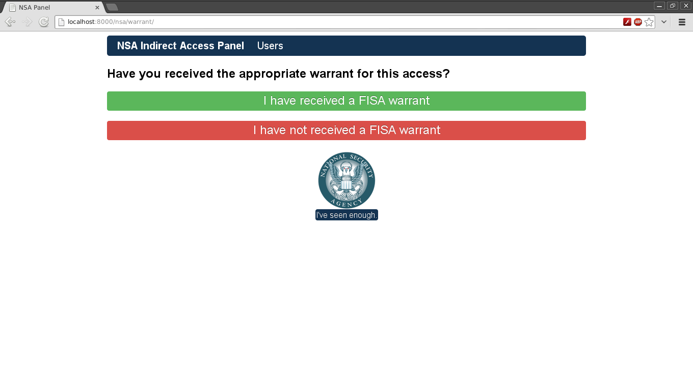
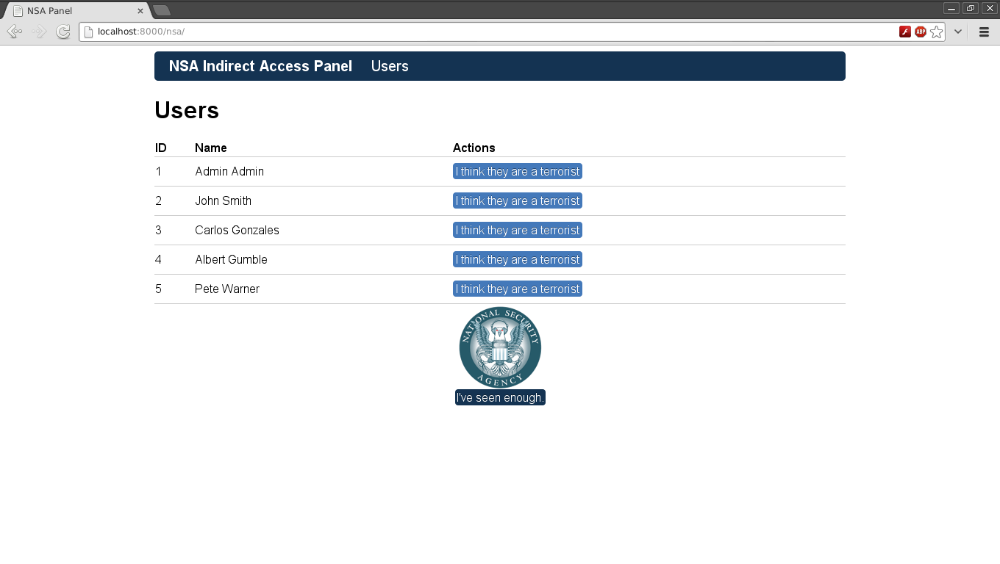
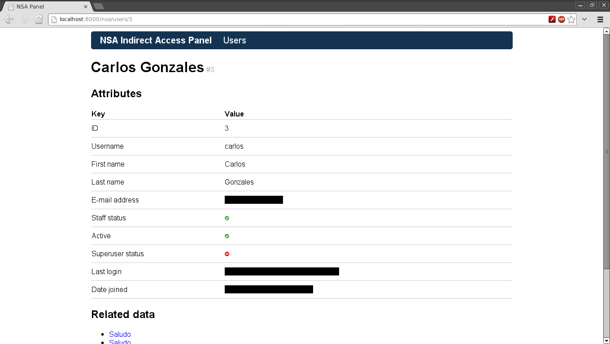
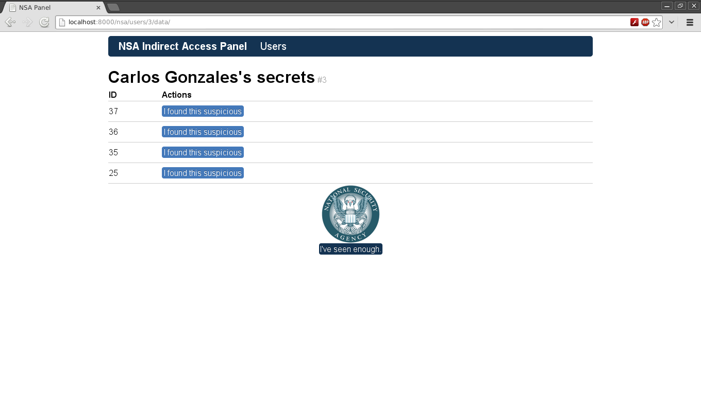
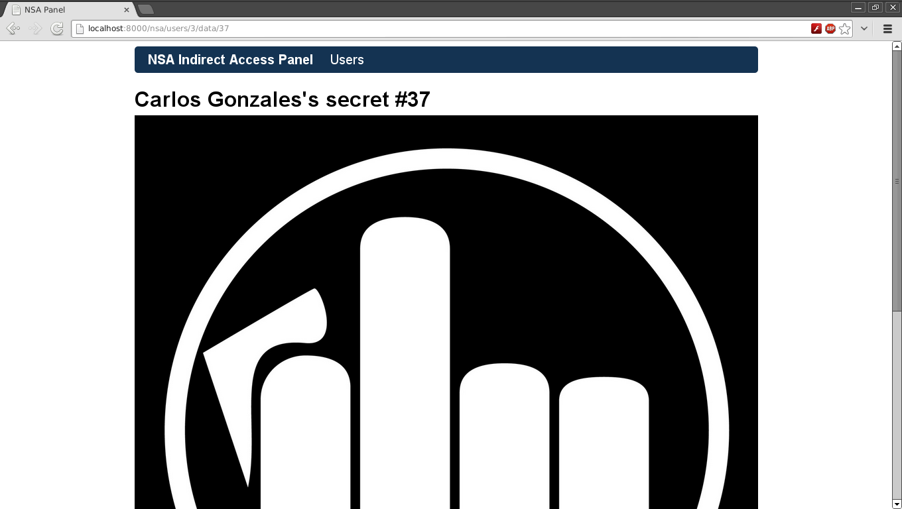

# NSA app for Django

An easy way for the NSA to see what's going on in our Django projects.
Let's ~~destroy the right to privacy~~ fight terrorism together!

## Freedom matters.

This particular app was written to join the forces of @goshakkk's [nsa_panel](https://github.com/goshakkk/nsa_panel) for Ruby on Rails and 
@plausibility's [flask-nsa](https://github.com/plausibility/flask-nsa) for Flask.

## Enforce.

Add `nsa` to your `INSTALLED_APPS` to your project's `settings.py` file.  
And this to your project's `urls.py` file: `url(r'^nsa/', include('nsa.urls'))`  
Test if everything is free as it should be: [http://localhost:8000/nsa](http://localhost:8000/nsa) (Use nsa/nsa as credentials).

## Enjoy.

Share the ~~end of privacy~~ good news (or don't, after all users shouldn't know too much):

> Dear X users, 

> You may be aware of reports alleging that X and several other Internet
> companies have joined a secret U.S. government program called PRISM to
> give the National Security Agency direct access to our servers. We would
> like to respond to the press reports, and give you the facts. 

> X is not and has never been part of any program to give the US or any
> other government direct access to our servers. We have never received a
> blanket request or court order from any government agency asking for
> information or metadata in bulk, like the one Verizon reportedly
> received. We hadn't even heard of PRISM before yesterday. 

> When governments ask X for data, we review each request carefully to
> make sure they always follow the correct processes and all applicable
> laws, and then only provide the information if is required by law. We
> will continue fighting aggressively to keep your information safe and
> secure. Any suggestion that X is disclosing information about our users’
> Internet activity on such a scale is completely false. 

> We strongly encourage all governments to be much more transparent about
> all programs aimed at keeping the public safe. It's the only way to
> protect everyone's civil liberties and create the safe and free society
> we all want over the long term. We here at X understand that the U.S.
> and other governments need to take action to protect their citizens’
> safety—including sometimes by using surveillance. But the level of
> secrecy around the current legal procedures undermines the freedoms we
> all cherish.

\o/ yay.

## How it looks like.

## Inspiration.

* [flask-nsa](https://github.com/plausibility/flask-nsa) by @plausibility.
* [nsa_panel](https://github.com/goshakkk/nsa_panel) by @goshakkk.

## Pypi

* [django-nsa](https://pypi.python.org/pypi/django-nsa)

## License.

[MIT](LICENSE).

NSA Eagle Logo credit [EFF](https://www.eff.org/pages/eff-nsa-graphics).  
CSS and base Templates [flask-nsa](https://github.com/plausibility/flask-nsa) and [960 Grid System](http://960.gs/).  
`icon-yes.gif` and `icon-no.gif` [Django Project](https://www.djangoproject.com/).
